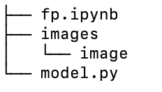

# Anime_Pic_Generation

This repo does not include the dataset. The dataset can be found using this link: https://www.kaggle.com/datasets/splcher/animefacedataset

By default, the TensorFlow data loader function will assume that there will be sub-folders for categories under the main folder. To make sure it can read the dataset without changing the code, make sure to adjust the directory:

where the `image` will contain all the image datasets.

### File

`model.py`: Python file that includes the construction of generator and discriminator for DCGAN.

`fp.ipynb`: Jupyter Notebook that is used to train and show the model.